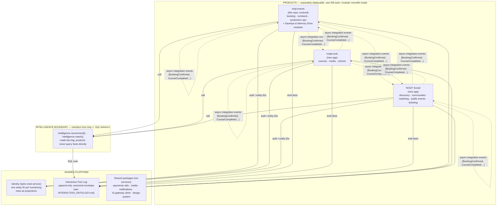

# NOQT — Software Architecture

> Status: Foundation document, v1 (2026-07-19). Target horizon: 12–18 months.
> Companion docs: `PRODUCT_VISION.md` (why), `INTERACTION_ONTOLOGY.md` (the fact log language).
> Constraint honored throughout: optimize for a strong foundation, fast delivery, and low risk of breaking the existing revenue-generating product. Do not design for hypothetical scale.

## 1. Current-State Assessment (as of 2026-07-19 audit)

One Next.js 16 / React 19 / Supabase / Clerk / Vercel monolith (this repo) containing the noqt.events business plus two accidental standalone mini-products (Dijital Davetiye, Memory Drive) and internal tooling. Key findings that drive the migration plan:

| Finding | Evidence | Severity |
|---|---|---|
| No migration tooling — 37 unordered SQL files at repo root, applied manually | `supabase-*.sql`, defensive "column may not exist" code in `src/app/api/payment/iyzico/callback/route.ts:46` | High |
| RLS policies without `TO service_role` expose several tables to public anon-key read/write | `supabase-schema.sql:87-112`, `supabase-davetiye.sql:60-67`, `supabase-memory.sql:44-48` | **Critical** |
| Two unreconciled "event" models | `bookings` (commerce) vs `event_projects` (planning), nullable link only | High |
| Identity is ad-hoc email matching, duplicated | `src/lib/adminAuth.ts` (admin allowlist), `src/lib/artistAuth.ts` (email → `dj_profiles`) | High |
| Hardcoded secret in a temporary endpoint | `src/app/api/admin/apply-rider-templates/route.ts:7` | High |
| Flat 34-file `src/lib` mixing auth/domain/infra/PDF | `src/lib/*` | Medium |
| In-memory rate limiting (ineffective on serverless) | `src/lib/rateLimit.ts` | Medium |
| Two parallel write patterns (Server Actions vs Route Handlers) chosen ad hoc | e.g. `src/app/admin/*/actions.ts` vs `src/app/api/**` | Medium |
| Dead route config (`/partner/dashboard` protected but nonexistent) | `src/proxy.ts:6` | Low |

**What is stable and must not be rewritten:** PDF generation (`src/lib/generate*Pdf.tsx`), pricing/terms math (`src/lib/bookingTerms.ts`, `src/lib/paymentPlan.ts`), iyzico server-side payment verification, Clerk wiring, SSRF-hardened media proxy routes.

## 2. Target Architecture (12–18 months)

**Chosen model: Hybrid — product-first structure with a domain-informed shared platform** (~80/20). Rejected alternatives are recorded in §10.

### 2.1 Structural rules

1. **Three separately deployable products, three databases.** Founder decision (2026-07-19): the long-term target is a **separate database per product**. Hard schema boundaries within one Supabase project are acceptable only as a transitional state — see §4 migration. No shared application database, ever.
2. **Each product is internally a modular monolith**: modules organized by product capability (`booking-event/`, `davetiye/`, `memory-drive/`, `partners/` …), each owning its tables; a module never reads or writes another module's tables directly — cross-module access goes through explicit internal functions.
3. **Shared platform = one real service + libraries.** Identity is the only real (independently consumed) service from Day 1 — federated login across separately deployed products requires it. Payments, media, notifications, AI gateway, intelligence, design system are **versioned internal packages**, promoted to real services only when a concrete operational need forces it (empirical trigger: a second consumer + coordination bottleneck).
4. **Transactional models are product property.** Booking state machines, enrollment records, matches: owned, private, never generalized speculatively.
5. **Shared primitives, minimal:** Event (time/place/capacity/visibility) and Group (people + shared space) exist as shared *schema primitives* that products extend — justified because ≥2 products concretely need each (events: noqt.events private events, Social public events, club workshops; groups: Social communities, club cohorts). They are libraries/schemas, not deployed services.

### 2.2 Anti-coupling rules (enforced, not aspirational)

- **Reference by ID only.** Products store platform entity IDs; never foreign keys into another product's tables; never cross-product joins.
- **Single writer per entity.** Exactly one product (or the platform) writes any given record.
- **Async integration only.** Cross-product effects flow through integration events (`BookingConfirmed`, `CourseCompleted`, `PersonVerifiedArtist`), consumed as subscriptions — never synchronous reads of another product's internals.
- **Intelligence via the boundary.** Products call `intelligence.*` functions; only the intelligence module reads the fact log.
- **Divestiture test at every roadmap review:** any product must be removable without breaking the others except through the platform layer.

### 2.3 Data ownership

| Data | Owner | Writers |
|---|---|---|
| Canonical entities (person/org/venue/community…), roles | Platform (Identity) | Identity service only |
| Interaction fact log | Platform | All products emit; nobody updates (append-only) |
| Bookings, contracts, production ops, service-partner catalog, Davetiye, Memory Drive | noqt.events | noqt.events only |
| Courses, curriculum, enrollments, certificates, content | noqta.club | noqta.club only |
| Social profiles, matches, communities, public listings, tickets, chat | NOQT Social | NOQT Social only |
| Event / Group primitive rows | Platform schema; products own their extension rows | Extending product |
| Payment transactions/ledger | Platform (payments package, shared tables) | Payments package only |
| Media assets | Platform storage; reference-owned by uploader product | Media package |

Rule of thumb: **if two products would plausibly write the same row, it's platform data; otherwise single-owner.**

### 2.4 Privacy & visibility boundaries

- Every fact carries a visibility class (`public` / `product-private` / `sensitive` — defined in `INTERACTION_ONTOLOGY.md`). Cross-product intelligence runs with an explicit visibility allowlist; dating-context facts must never surface in professional contexts. This is default-deny, designed in from Day 1.
- Persons are special entities: consent, KVKK/GDPR erasure (tombstone redaction in the fact log), authentication. Organizations/venues do not get erasure rights over their edges.
- Fix the current RLS exposure (add `TO service_role` or drop the permissive policies) **before** any new architecture work — it is a live risk today.

## 3. Day 1 vs. Later

**Day 1 (roughly one week of platform work + ongoing discipline):**
- Identity spine: canonical entity IDs, role projections (start by mapping Clerk users + `dj_profiles`/`partner_profiles` onto it)
- Fact log: one Postgres table with the canonical envelope; emission wired into existing transaction points (booking confirmed, payment completed, review submitted…)
- Verb/context/entity-kind registries as docs + a validation function
- `intelligence.*` interface — v1 is plain SQL (or hand-curation; at current user counts hand-curation beats models)
- Real migration tooling; RLS fixes; secret rotation
- Design system stays as-is (`src/components/ui`), published as a package when the second app starts

**Later (empirical triggers only, do not build early):**
- Graph database / traversal engine — only when a concrete query is impossible/slow in SQL
- Embeddings, learned models, collaborative filtering — needs interaction volume
- Trust/reputation scoring — meaningless at low volume ("noise with authority")
- Intelligence, payments, media, notifications as deployed services — trigger: second consumer + bottleneck
- Chat/messaging infrastructure — build inside the first product that needs it, extract at second consumer
- Confidence-scored inferred edges (intelligence layer, never the fact log)

## 4. Migration Strategy (from this repo)

Sequenced to never break the revenue-generating product.

> **Implementation status (2026-07-19): NOT STARTED — by founder decision, no security fixes or application-code changes are to be implemented yet.** The steps below are the approved *plan*; each step (including step 1) begins only on explicit founder go-ahead. The security items in step 1 remain the recommended first action whenever implementation is authorized.

1. **Stop the bleeding (days):** RLS `TO service_role` fixes; delete/rotate `apply-rider-templates` token; remove dead `/partner/dashboard` matcher.
2. **Migration tooling (week 1):** adopt Supabase CLI migrations (or Drizzle); snapshot current schema as baseline migration; retire the 37 loose SQL files into `docs/legacy-sql/` or delete after verification. New schema changes only via tooling.
3. **Fact log + identity mapping (week 1–2):** create the fact table + registries per `INTERACTION_ONTOLOGY.md`; create the entity registry seeded from Clerk users, `dj_profiles`, `partner_profiles`; add fact emission to existing transaction completion points. No behavior change to the product.
4. **Modularize in place (ongoing, opportunistic):** reorganize `src/lib` flat files into product modules (`booking-event/`, `davetiye/`, `memory-drive/`, `platform/…`) as files are touched — no big-bang refactor.
5. **Unify the event model (before building on it):** merge `bookings` + `event_projects` into one lifecycle model with commercial facts structurally separated from event facts. Prerequisite for any Event-primitive sharing.
6. **Second product — NOQT Social (founder decision 2026-07-19; noqta.club follows later):** new app, new database (per §2.1 rule 1), consumes Identity + design system + fact log from day one. This is the moment Identity must be a real service and shared packages get extracted into a workspace/monorepo structure (tooling decision deferred until then).

## 5. Risks

| Risk | Mitigation |
|---|---|
| RLS exposure exploited before fix | §4 step 1 is the recommended first implementation action; risk remains live until founder authorizes it |
| Fact-log discipline erodes (products skip emission) | Emission wired into transaction functions, not left to feature code; registry validation rejects unregistered verbs |
| Social/ticketing gravity pulls public events into noqt.events | Boundary decision recorded in `PRODUCT_VISION.md` §4.3; review at roadmap checkpoints |
| Solo-founder bandwidth: platform work starves product work | Day-1 platform scope capped at ~1 week; everything else has empirical triggers |
| Event-model unification breaks live bookings | Do it behind the existing API surface, migrate data with tooling from §4.2, verify against live flows |
| Premature service extraction | Rule: no service without a second real consumer + demonstrated bottleneck |

## 6. Decision Records

| # | Decision | Alternatives rejected | Why |
|---|---|---|---|
| ADR-1 | Hybrid product-first architecture (~80/20) | Pure product-first; pure domain-first | Product-first alone reproduces the "identity crammed into `dj_profiles`" failure; domain-first front-loads contracts for domains with 0–1 consumers and matches no organizational reality (solo founder) |
| ADR-2 | Modular monolith per product; no microservices | Service-per-domain | No team to own services; module boundaries give contract discipline at monolith cost |
| ADR-3 | Identity is a real shared service from Day 1 | Internal library | Three products with federated login = three real consumers; hardest thing to retrofit |
| ADR-4 | Fact log is Day 1; graph infrastructure is deferred | Graph DB now; log later | History can't be retrofitted (the asset); graph queries can be (the machinery). SQL suffices for years at current scale |
| ADR-5 | Trust is computed, never stored | Stored trust/reputation scores | Trust is perishable & re-derivable; storing it corrupts ground truth and ages badly |
| ADR-6 | Matching & Recommendation: separate functions, one module, not services | Two services; one merged concept | Distinct questions (fit vs. next-best-surface) but ~150 lines of combined logic today |
| ADR-7 | Event & Group as shared schema primitives, not services | Full Event Engine service; nothing shared | ≥2 concrete consumers each; a service has no second runtime consumer yet |
| ADR-8 | NOQT Social owns public discovery & ticketing, even for noqt.events-produced events | Ticketing inside noqt.events | Different buyer, revenue model, and loop; the boundary most likely to erode via shortcuts |
| ADR-9 | No shared application database | One shared DB | Coupling via schema is the failure mode this whole design exists to prevent |
| ADR-10 | Confidence excluded from fact envelope | Confidence per fact | Facts are ground truth (things that happened); beliefs live in the intelligence layer |

## 7. Decisions Ratified by Founder (2026-07-19)

- [x] Davetiye / Memory Drive remain noqt.events modules for now; may be separated later (keep their table/route independence intact so separation stays cheap)
- [x] Second product is **NOQT Social**; noqta.club follows later
- [x] Long-term target: **separate database per product** (schema-per-product only as a transitional state)
- [x] Product names are provisional — keep neutral identifiers (`events` / `club` / `social`) in schemas
- [x] No security fixes or application-code changes implemented yet — plan approved, implementation awaits explicit go-ahead (see §4 status note)

## 8. Remaining Open Decisions

- [ ] Monorepo/workspace tooling for the multi-app phase (decide at §4.6, not before)
- [ ] Timing of the transitional → separate-database move for the interim period (cost/ops tradeoff, decide at §4.6)
- [ ] Payments package unification timing (iyzico logic is booking-embedded today; extract when second product needs payments)
- [ ] Go-ahead date for migration step 1 (security fixes)
